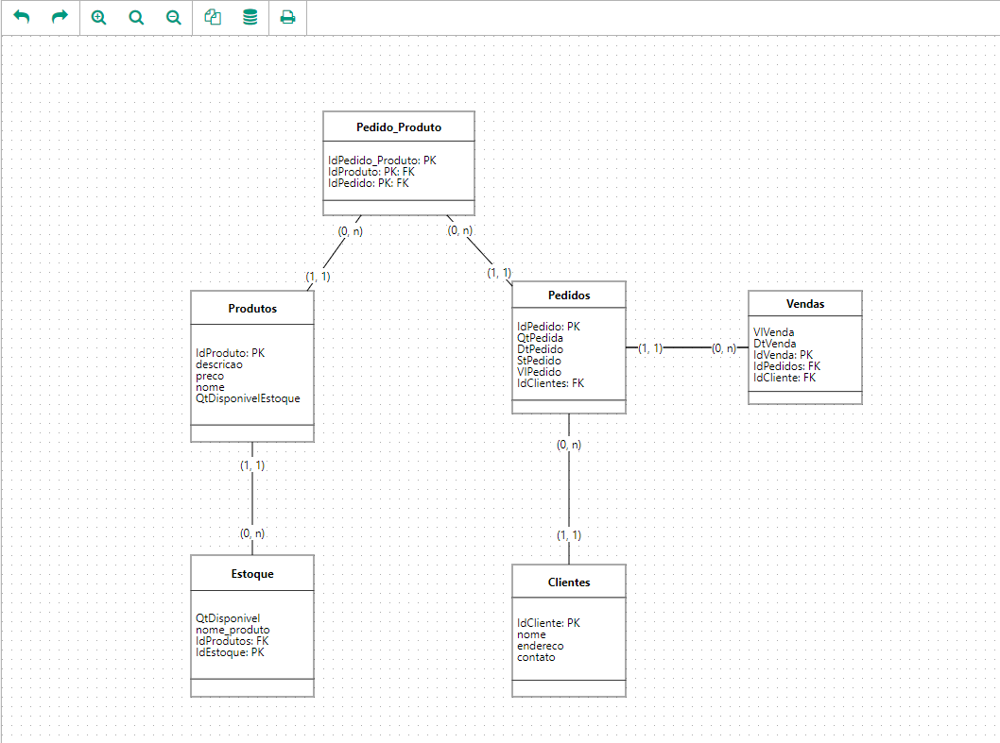

 <div align="center">
	<h1>API REST FULL de um E-commerce</h1>
	<br>
	<p align="center">
		<a href="https://www.linkedin.com/in/roni-febrone-97b007275/">
		  
		</a>
	</p>
</div>

<hr>


<h4>Descrição 📄</h4>

Aplicação desenvolvida para lidar com dados, armazenar e gerenciar informações de maneira eficiente.

OBS: Modelagem ao fim do READEME.md

<hr>

<h4>Tecnologias 🚀</h4>

- Javascript
- node.js
- express.js
- cors
- sequelize

<hr>

<h4>Como rodar no seu computador🖥️</h4>

- Instale o [Node.js](https://nodejs.org/en/download/) e o [Git](https://git-scm.com/book/en/v2/Getting-Started-Installing-Git). Então:

```
# clone esse repositório
$ git clone https://github.com/RoniFebrone/<repo_name>.git

# acesse a pasta do projeto
$ cd <repo_name>

# instale as dependências
$ npm install

# rode o server
$ npm start

```
- Acesse a aplicação

<hr>

by Roni Febrone<br>
<div>
	<a href="https://www.linkedin.com/in/roni-febrone-97b007275/"> 
		
	</a>
</div>
<div align="center"> 
	<p> Modelagem do banco de dados </p>
    
</div>
